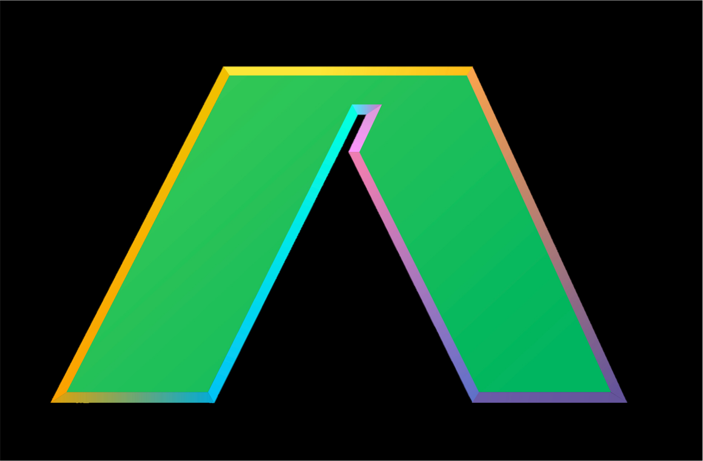

    
    <h1>Aide</h1>

**Aide is the Open Source AI-native code editor. It is a fork of VS Code, and integrates tightly with [the leading agentic framework](https://github.com/codestoryai/sidecar) on swebench-lite.**

	

Aide combines the powerful features of VS Code with advanced AI capabilities to provide:

* **A combined chat + edit flow** - Brainstorm a problem in chat by referencing files and jump into edits (which can happen across multiple files).
* **Proactive agents** - AI iterates on linter errors (provided by the Language Server) and pulls in relevant context using go-to-definitions, go-to-references, etc to propose fixes or ask for more context from you.
* **Inline editing widget** - Similar to the macos spotlight widget, press Ctrl/Cmd+K at any point to give instructions to AI.
* **Intelligent Code Completion** - Context-aware code suggestions powered by state-of-the-art AI models.
* **AST navigation** - Quickly navigate files in blocks rather than line-by-line.

Aide is designed to be your intelligent coding companion, helping you write better code faster while maintaining full control over your development process.

## Contributing

There are many ways in which you can participate in this project, for example:

* [Submit bugs and feature requests](https://github.com/codestoryai/aide/issues), and help us verify as they are checked in
* Review [source code changes](https://github.com/codestoryai/aide/pulls)

If you are interested in fixing issues and contributing directly to the code base,
please see the document [How to Contribute](https://github.com/codestoryai/aide/blob/cs-main/HOW_TO_CONTRIBUTE.md), which covers the following:

* [How to build and run from source](https://github.com/codestoryai/aide/blob/cs-main/HOW_TO_CONTRIBUTE.md)
* [The development workflow, including debugging and running tests](https://github.com/codestoryai/aide/blob/cs-main/HOW_TO_CONTRIBUTE.md#debugging)
* [Coding guidelines](https://github.com/codestoryai/aide/wiki/Coding-Guidelines)
* [Submitting pull requests](https://github.com/codestoryai/aide/blob/cs-main/HOW_TO_CONTRIBUTE.md#pull-requests)
* [Finding an issue to work on](https://github.com/codestoryai/aide/blob/cs-main/HOW_TO_CONTRIBUTE.md#where-to-contribute)

## Feedback

* [File an issue](https://github.com/codestoryai/aide/issues)
* [Request a new feature](CONTRIBUTING.md)
* Upvote [popular feature requests](https://github.com/codestoryai/aide/issues?q=is%3Aopen+is%3Aissue+label%3Afeature-request+sort%3Areactions-%2B1-desc)
* Join our community: [Discord/Community Link]

## Development Container

This repository includes a Visual Studio Code Dev Containers / GitHub Codespaces development container configuration for easy setup of your development environment.

* For [Dev Containers](https://aka.ms/vscode-remote/download/containers), use the **Dev Containers: Clone Repository in Container Volume...** command which creates a Docker volume for better disk I/O on macOS and Windows.
  * If you already have VS Code and Docker installed, you can also click [here](https://vscode.dev/redirect?url=vscode://ms-vscode-remote.remote-containers/cloneInVolume?url=https://github.com/codestoryai/aide) to get started. This will cause VS Code to automatically install the Dev Containers extension if needed, clone the source code into a container volume, and spin up a dev container for use.

* For Codespaces, install the [GitHub Codespaces](https://marketplace.visualstudio.com/items?itemName=GitHub.codespaces) extension in VS Code, and use the **Codespaces: Create New Codespace** command.

Docker / the Codespace should have at least **4 Cores and 6 GB of RAM (8 GB recommended)** to run full build. See the [development container README](.devcontainer/README.md) for more information.

## Code of Conduct

This project has adopted the [Microsoft Open Source Code of Conduct](https://opensource.microsoft.com/codeofconduct/). For more information see the [Code of Conduct FAQ](https://opensource.microsoft.com/codeofconduct/faq/) or contact [opencode@microsoft.com](mailto:opencode@microsoft.com) with any additional questions or comments.

## License

Copyright (c) 2024 CodeStory AI. All rights reserved.
Licensed under the [GNU Affero General Public License v3.0](LICENSE.md).
